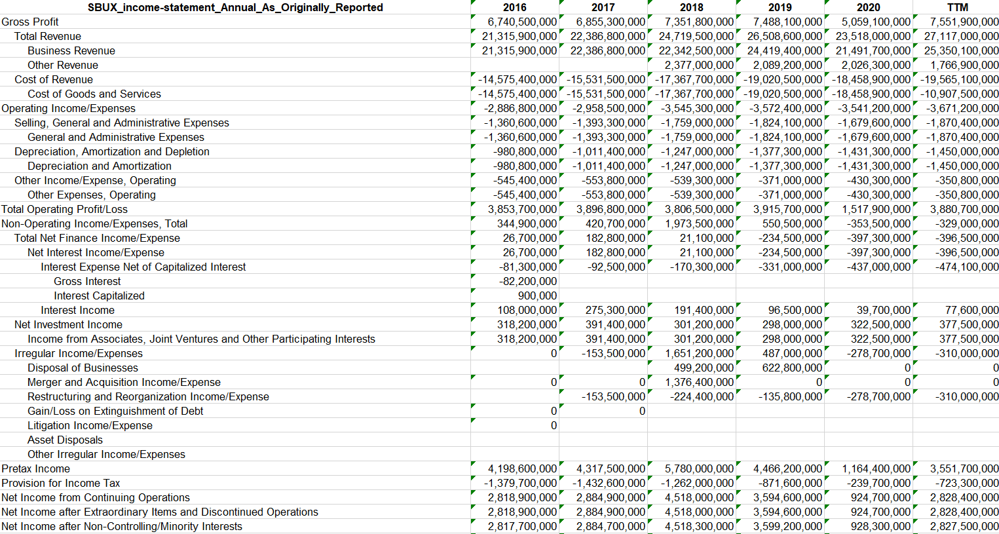
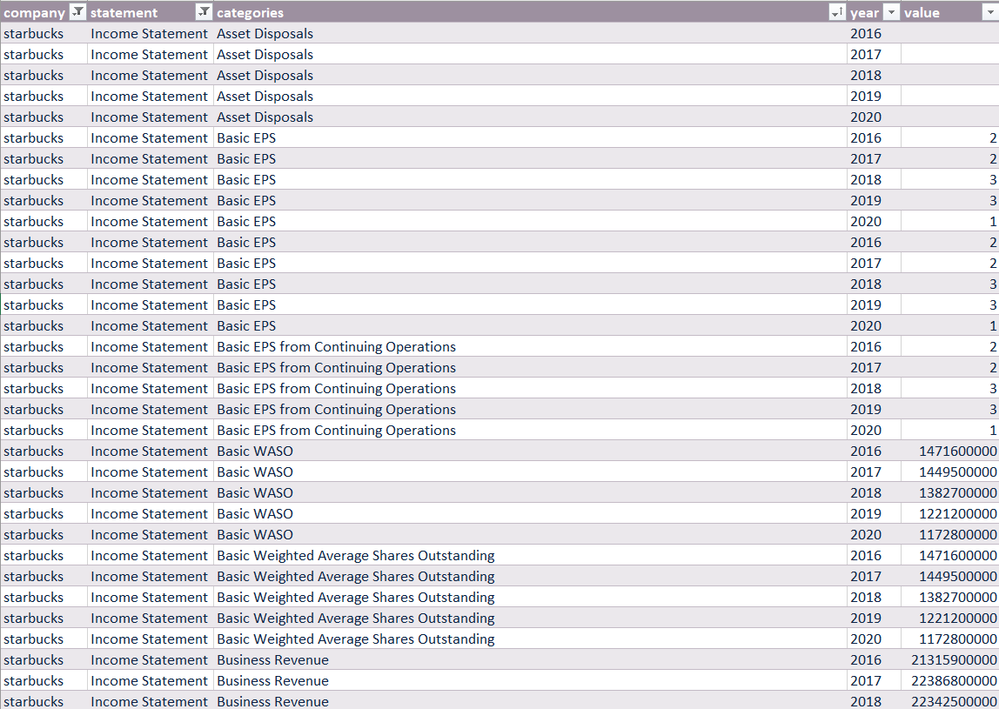
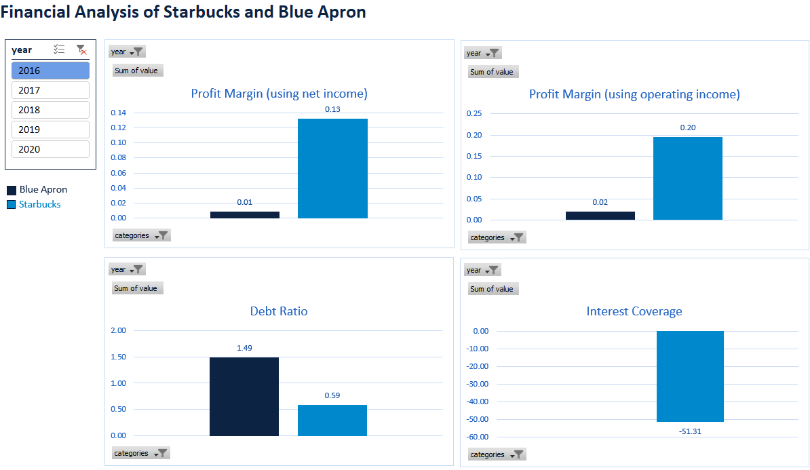
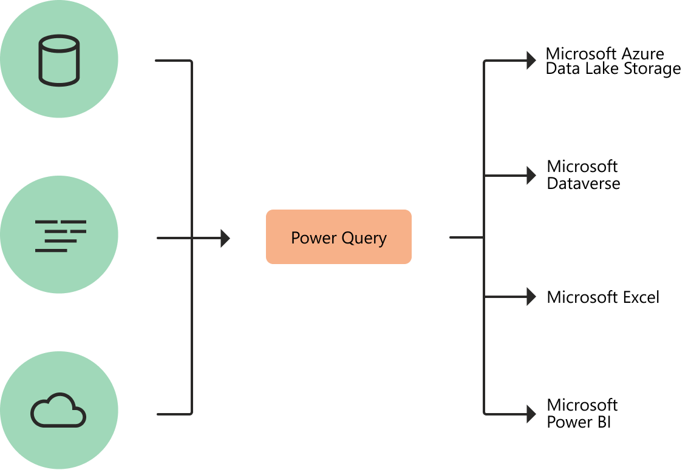

```{css, echo=FALSE}
# CSS for including pauses in printed PDF output (see bottom of lecture)
@media print {
  .has-continuation {
    display: block !important;
  }
}

.remark-slide-scaler {
    overflow-y: auto;
}
```

```{r setup, include=FALSE}
options(htmltools.dir.version = FALSE)
library(knitr)
opts_chunk$set(
  fig.align="center",  
  fig.height=4, #fig.width=6,
  # out.width="748px", #out.length="520.75px",
  dpi=300, #fig.path='Figs/',
  cache=T#, echo=F, warning=F, message=F
  )
library(tidyverse)
library(hrbrthemes)
library(fontawesome)
```


# Lab Prep

☑ To add

---

# Overview

- Explore data cleaning steps using Power Query
- Create Pivot Tables and calculated items 
- Build a dashboard

---

# Learning Outcomes

- Import and consolidate data using Power Query
- Automate data cleaning steps in Excel
- Create a dashboard with slicers
- Update/Refresh tables with new data 

---

# Why Excel?

```{r, echo = FALSE, out.width = "85%"}
knitr::include_graphics("figs/apps.jpg")
```

---
# Roadmap

```{r, echo = FALSE, out.width = "100%"}

```

---
# Roadmap

```{r, echo = FALSE, out.width = "85%"}

```

---
# Roadmap

```{r, echo = FALSE, out.width = "85%"}

```

---
# Power Query

Have any of you used Power Query in the past?

---
# Power Query

“Power Query is a data transformation and data preparation engine. Power Query comes with a graphical interface for getting data from sources and a Power Query Editor for applying transformations.” 

What do you think are the advantages/disadvantages of using Power Query compared to R/Python?


```{r, echo = FALSE, out.width = "50%"}

```

.footnote[
[1] [What is Power Query?](https://docs.microsoft.com/en-us/power-query/power-query-what-is-power-query)
]

---

# Why use Power Query?

- Can fetch and consolidate data from various sources + update when you data comes in

- Automate tasks without the need for VBA programming

- Allows your GP partner to continue using your final output after you leave – legacy document

---

# Some challenges

- Might not work well if the format of the data changes

- Need to have Excel 2016 onwards

- Can refresh data on Mac Excel, but cannot open Power Query editor

---

# Data setup

- Create a lab_516 folder and “data” subfolder
- Download financial data in Morningstar website (in .xls) 
  - Do not save this in the “data” folder. Either save it in the lab_516 folder or keep it in your “Downloads” folder
- Open file in Excel -> Click “Enable Editing” -> Save As Excel workbook (.xlsx) in the “data” folder
- Use meaningful file names – important for later!
  - Starbucks-cash-flow.xlsx
  - Starbucks-balance-sheet.xlsx
  - Starbucks-income-statement.xlsx


```{r convert, include = F}
#library(xaringanBuilder)

#build_pdf("C:/Users/krishlim/OneDrive - UBC/Desktop/mfre/workshop2/presentation/data-viz.html")

# windowsFonts()
# library(extrafont)
# remotes::install_version("Rttf2pt1", version = "1.3.8")
# font_import()
# loadfonts(device = "win") 
# https://stackoverflow.com/questions/14733732/cant-change-fonts-in-ggplot-geom-text
```
