```{css, echo=FALSE}
# CSS for including pauses in printed PDF output (see bottom of lecture)
@media print {
  .has-continuation {
    display: block !important;
  }
}

.remark-slide-scaler {
    overflow-y: auto;
}
```

```{r setup, include=FALSE}
options(htmltools.dir.version = FALSE)
library(knitr)
opts_chunk$set(
  fig.align="center",  
  fig.height=4, #fig.width=6,
  # out.width="748px", #out.length="520.75px",
  dpi=300, #fig.path='Figs/',
  cache=T#, echo=F, warning=F, message=F
  )
library(tidyverse)
library(hrbrthemes)
library(fontawesome)
```


# Lab Prep

☑ Download files uploaded on Canvas

☑ Go through the slides and try working through the example

☑ Read the other assigned readings for this lab

☑ If you are a Mac user, find a friend who has a Windows laptop and can run Power Query on their device and sit beside them during the lab! 

---

# Learning Outcomes

- Import and consolidate data using Power Query
- Automate data cleaning steps in Excel
- Create a dashboard with slicers ("visual filters")
- Update/Refresh tables with new data 

---

# Why Excel?

```{r, echo = FALSE, out.width = "85%"}
knitr::include_graphics("figs/apps.jpg")
```

---
# Roadmap - Raw Data

```{r, echo = FALSE, out.width = "100%"}
knitr::include_graphics("figs/rawdata.png")
```

---
# Roadmap - Tidy Data

```{r, echo = FALSE, out.width = "85%"}
knitr::include_graphics("figs/tidydata.png")
```

---
# Roadmap - Dashboard

```{r, echo = FALSE, out.width = "85%"}
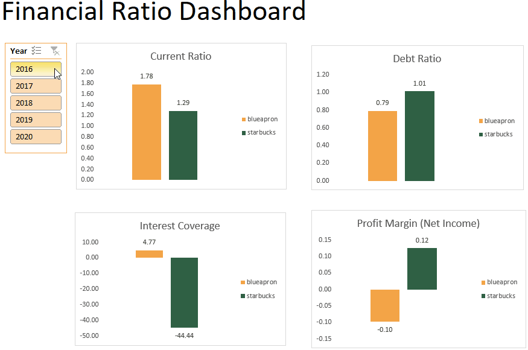
```

---
# Power Query

“Power Query is a data transformation and data preparation engine. Power Query comes with a graphical interface for getting data from sources and a Power Query Editor for applying transformations.” 


```{r, echo = FALSE, out.width = "50%"}
knitr::include_graphics("figs/powerquery.png")
```

.footnote[
[1] [What is Power Query?](https://docs.microsoft.com/en-us/power-query/power-query-what-is-power-query)
]


---
# Power Query

Have any of you used Power Query in the past?

What do you think are the advantages/disadvantages of using Power Query compared to R/Python?


---

# Why use Power Query?

- Can fetch and consolidate data from various sources + update when you data comes in

- Automate tasks without the need for VBA programming

- Allows your GP partner to continue using your final output after you leave – legacy document

---

# Some challenges

- Might not work well if the format of the data changes

- Need to have Excel 2016 onwards

- Can refresh data on Mac Excel, but cannot open Power Query editor

---

# Data setup

- Create a "lab_516" folder and “data” sub-folder 
- Download financial data in Morningstar website (in .xls) - [Starbucks](https://www.morningstar.com/stocks/xnas/sbux/financials) and [Blue Apron](https://www.morningstar.com/stocks/xnys/aprn/financials)
  - Do not save these files in the “data” folder. Either save it in the "lab_516" folder or keep it in your “Downloads” folder
- Open file in Excel -> Click “Enable Editing” -> Save As Excel workbook (.xlsx) in the “data” folder
- Use meaningful file names – important for later!
  - starbucks-cashflow.xlsx
  - starbucks-balancesheet.xlsx
  - starbucks-incomestatement.xlsx

---

# Go to Power Query in Excel

- Open up a new Excel spreadsheet

- Power Query Editor *will not* work if any of the files you will load is opened. 

---

# Suggested Steps

- Data tab -> Get Data -> From File -> From Folder -> Locate your "data" folder -> "OK" 

```{r, echo = FALSE, out.width = "40%"}
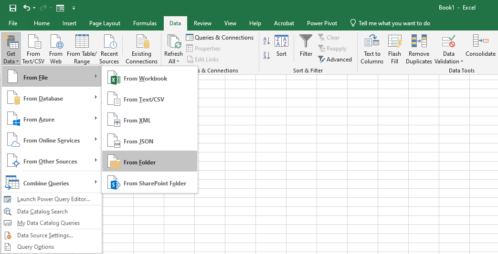
```

- Click "Transform Data"  

```{r, echo = FALSE, out.width = "40%"}
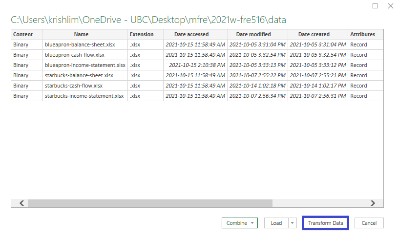
```

---

# Suggested Steps

Now your screen will look something like this

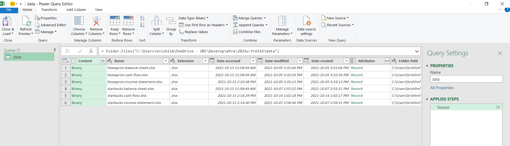

---

# Suggested Steps

We use the syntax *Excel.Workbook([Content])* to return the contents of the Excel workbook. 

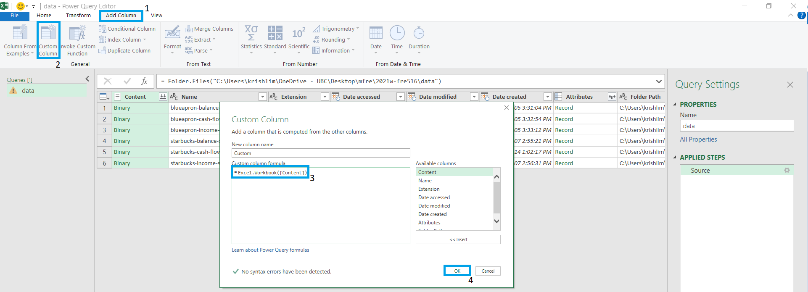

---

# Suggested Steps

- Delete irrelevant columns (keep only Name and Custom)
  - Select columns to drop -> Right click -> Remove Columns
- Expand Custom column 
- Delete irrelevant columns (keep only Name, Custom.Data)
- Expand Custom.Data column 
- Click table icon on the upper left area of the table (above row numbers) -> Use first row as headers
  - third to last columns should be years now (i.e., 2016, 2017, ..., 2020)

---

# Suggested Steps

- Select the second column -> Transform tab -> Format -> Trim (to align all to left)
- Rename column to "Categories" -> Filter values 
  - unmark "APRN_cash-flow_Annual_As_Originally_Reported", "APRN_income-statement-Quarterly_Restated", etc.)
- Add Column tab -> Column From Examples -> "Company" -> "blueapron"
  - We're using values in the first column to create this column
  - Why naming our sheets with meaningful names is important
- Add Column tab -> Column From Examples -> "Statement" -> "balancesheet" 
- Delete any irrelevant columns
- Reorder columns

---

# Suggested Steps

- Select columns 2016-2020 - Transform tab -> Unpivot columns
- Convert "Value" column to numeric format
- Rename "Attribute" to "Year" 

```{r, echo = FALSE, out.width = "80%"}
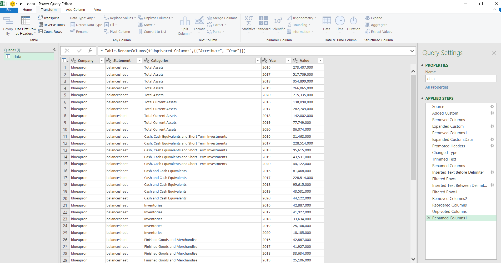
```

---

# Suggested Steps

- Click File -> Close and Load
- Now you will be back in Excel, with the tidy data in a Table
- Rename sheet to "data"

```{r, echo = FALSE, out.width = "53%"}
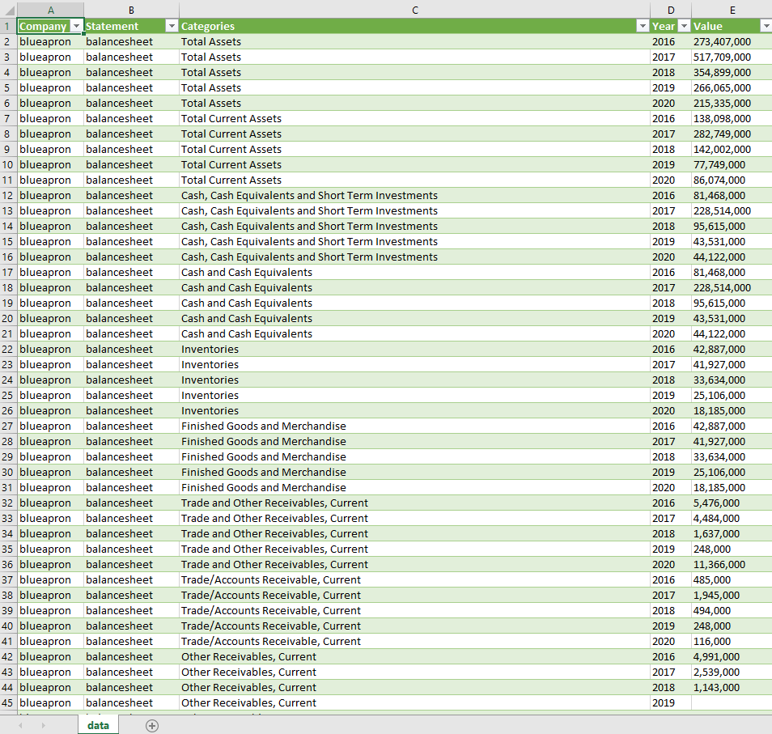
```

---

# Suggested Steps

- The next steps would be to create a pivot table containing financial ratios
- We will use custom formulas in Excel's pivot table (specifically Calculated Item)
- Read more about Calculated Item [here](https://support.microsoft.com/en-us/office/calculate-values-in-a-pivottable-11f41417-da80-435c-a5c6-b0185e59da77) or [here](https://www.contextures.com/calculatedfieldcalculateditem.html)

---

# Suggested Steps

1. Click anywhere on the Table -> Insert tab -> Pivot Table -> OK
2. Drag Year to Filters, Company to Columns, Category to Rows, Value to Values
3. Click anywhere on the cell of your Pivot Table (e.g., cell A5)
4. Analyze tab -> Fields, Items, & Sets -> Calculated Item

```{r, echo = FALSE, out.width = "75%"}
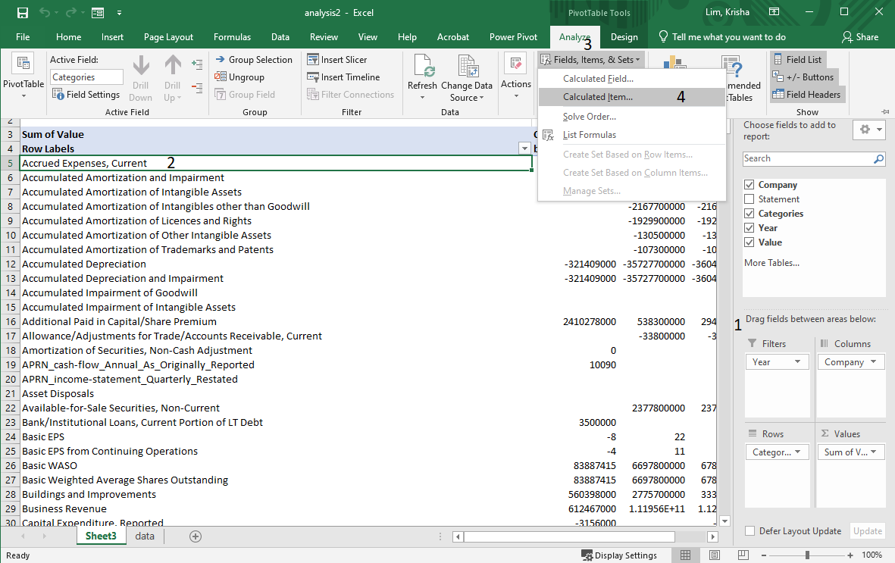
```

---

# Suggested Steps

- Type in the relevant formula of the ratio
  - Use meaningful names
  - Can be tricky with the category names (i.e., "Total Operating Profit/Loss" value is different from "Total Operating Profit/Loss, Supplemental")
  
```{r, echo = FALSE, out.width = "80%"}
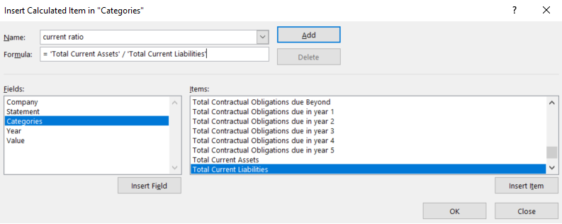
```

---

# Formulas

1. Current Ratio = 'Total Current Assets' /'Total Current Liabilities’
2. Interest Coverage ='Total Operating Profit/Loss as Reported, Supplemental'/'Interest Expense Net of Capitalized Interest'
3. Debt ratio = 'Total Liabilities'/'Total Assets’
4. Profit margin (using operating profits) = 'Total Operating Profit/Loss as Reported, Supplemental'/ 'Total Revenue as Reported, Supplemental'
5. Profit margin (using net income) = 'Net Income Available to Common Stockholder' / 'Total Revenue as Reported, Supplemental'

---

# Suggested Steps

- After you have created your formulas, go back to your Pivot Table and filter to those values only in "Categories"
  - I moved "Year" to Columns to show all values
- Looks like something is wrong with the Blue Apron calculation

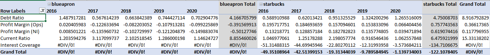

---

# Suggested Steps

- Upon closer look of the Net Income Statement, Starbucks has a "Interest Expense Net of Capitalized Interest" but Blue Apron does not.
- Both have "Net Interest Income/Expense"
- For this exercise, I will just use this variable (i.e., Net Interest Income/Expense) to calculate "Interest Coverage"
- To modify the formula, open up Calculated Item -> Interest Coverage -> Change the formula -> Modify -> OK

```{r, echo = FALSE, out.width = "80%"}
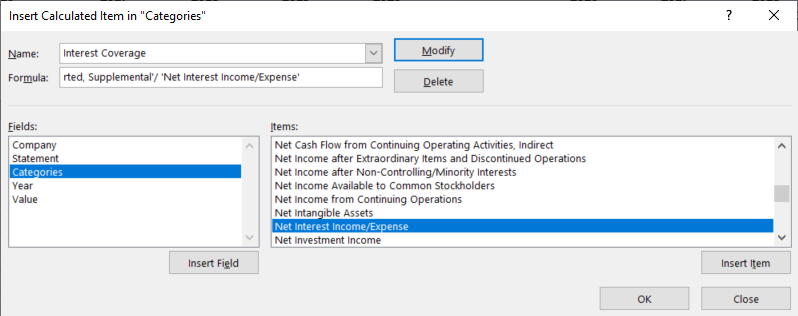
```

---

# Creating Pivot Charts

- Since we want one chart per ratio, we should just create separate Pivot Tables where each Pivot Table will contain the value of one financial ratio.
- For each Pivot Table, insert a Pivot Chart and format the chart (e.g., use themes, 2 decimal places only, add data labels, delete axis labels, chart titles, etc.)
- It is a good idea to label your Pivot Tables with meaningful names also (Analyze Tab -> rename "PivotTable1" to "currentratio")
  - Useful for later when we connect different charts with a slicer
- To "clone" a Pivot Table, select a Pivot Table -> Analyze tab -> Select -> Entire Pivot Table -> Ctrl + C -> Ctrl + V
- Right click on any of the buttons (e.g., "Year", "Sum of Value") -> "Hide All Field Buttons on Chart"

---

# Creating Pivot Charts

- Here's my current worksheet (called charts)

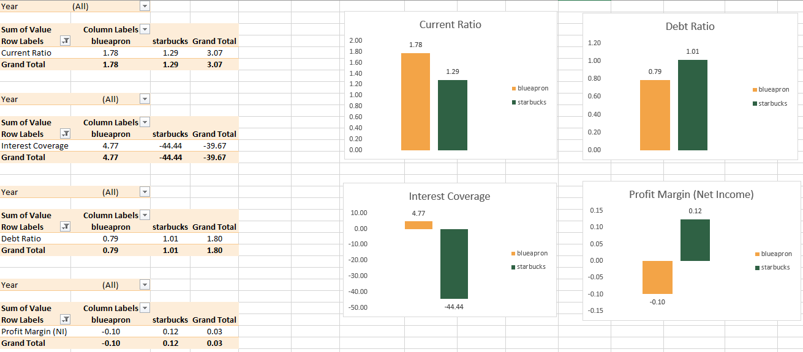

---

# Creating a Dashboard

- Slicers allow you or your users to filter data and visualizations. 
- You can also choose which Pivot Tables and/or Pivot Charts are connected by the slicer. 

.footnote[
[1] [Slicers in Power BI](https://docs.microsoft.com/en-us/power-bi/visuals/power-bi-visualization-slicers)

[2] [Use slicers to filter data](https://support.microsoft.com/en-us/office/use-slicers-to-filter-data-249f966b-a9d5-4b0f-b31a-12651785d29d)

]
---

# Creating a Dashboard

- Create a new sheet called dashboard
- View tab -> Unmark "Gridlines" so the sheet will just be white
- Copy your four Pivot Charts from the charts sheet to the dashboard sheet
- Click any Pivot Chart -> Insert tab -> **Slicer** -> Check "Year"
- Right click Slicer -> **Report Connections** -> check all relevant Pivot Charts
  - Why it's important to use meaningful Pivot Table names
- Based on the "Year" you select, the chart's values will change  

---

# Updating your dashboard

- Add the spreadsheets to your "data" folder
- In Excel, Data tab -> "Refresh All" (2x) 

```{r, echo = FALSE, out.width = "70%"}
knitr::include_graphics("figs/refreshing.gif")
```

---

# Updating your dashboard

- What's going on in the background?
- Recall that in our data setup, we asked Excel to get data from the "data" folder
- So every time we click "Refresh", Excel goes into that "data" folder and performs the Power Query steps that we have applied

.footnote[
[1] [Data Refresh in Power BI](https://docs.microsoft.com/en-us/power-bi/connect-data/refresh-data)
]

---

# Troubleshooting 

- What if you renamed your "data" folder or moved it to a different location in your computer? 
- When you click "Refresh," you will get this error

```{r, echo = FALSE, out.width = "80%"}
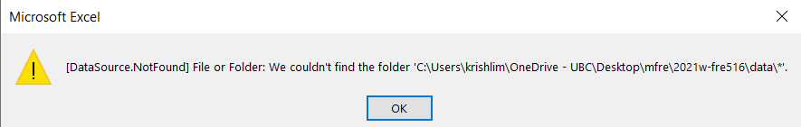
```

---

# Troubleshooting 

- Go to your data sheet -> Click anywhere on the table -> Query tab -> Edit
- Under Applied Steps on the right panel, click "Source" 
- In the formula, edit the file path to your "data" folder -> Enter

---

# Recap

- Downloaded financial statements from Morningstar (could be financial statements or any spreadsheets too)
- Imported and consolidated data using Power Query
- Automated steps to transform raw data to tidy data
- Calculated financial ratios using Excel's calculated fields
- Built Pivot Tables and Pivot Charts and a Dashboard that updates with new data

```{r convert, include = F}
#library(xaringanBuilder)

#build_pdf("C:/Users/krishlim/OneDrive - UBC/Desktop/mfre/workshop2/presentation/data-viz.html")

# windowsFonts()
# library(extrafont)
# remotes::install_version("Rttf2pt1", version = "1.3.8")
# font_import()
# loadfonts(device = "win") 
# https://stackoverflow.com/questions/14733732/cant-change-fonts-in-ggplot-geom-text
```
