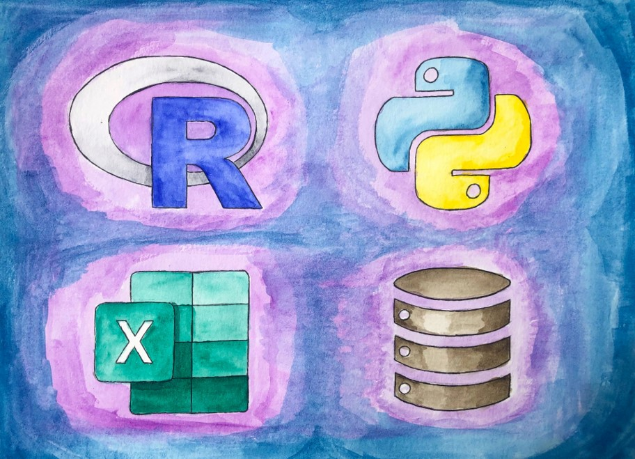

```{css, echo=FALSE}
# CSS for including pauses in printed PDF output (see bottom of lecture)
@media print {
  .has-continuation {
    display: block !important;
  }
}

.remark-slide-scaler {
    overflow-y: auto;
}
```

```{r setup, include=FALSE}
options(htmltools.dir.version = FALSE)
library(knitr)
opts_chunk$set(
  fig.align="center",  
  fig.height=4, #fig.width=6,
  # out.width="748px", #out.length="520.75px",
  dpi=300, #fig.path='Figs/',
  cache=T#, echo=F, warning=F, message=F
  )
library(tidyverse)
library(hrbrthemes)
library(fontawesome)
```


# Workshop preparation

☑ Download MFRE Data Workshop 2 Folder

☑ Open `Workshop 2.RProj` in RStudio

☑ Then go to `Code` folder and open up `data_viz.Rmd` 

---

# Overview

- Explore data cleaning steps using Power Query
- Create Pivot Tables and calculated items 
- Build a dashboard

---

# Learning Outcomes

- Import and consolidate data using Power Query
- Automate data cleaning steps in Excel
- Create a dashboard with slicers
- Update/Refresh tables with new data 

---

# Why Excel?

```{r, echo = FALSE, out.width = "85%"}

```

---
# Roadmap

```{r, echo = FALSE, out.width = "100%"}

```

---
# Roadmap

```{r, echo = FALSE, out.width = "85%"}
knitr::include_graphics("figs/tidydata.png")
```

---
# Roadmap

```{r, echo = FALSE, out.width = "85%"}

```


```{r convert, include = F}
#library(xaringanBuilder)

#build_pdf("C:/Users/krishlim/OneDrive - UBC/Desktop/mfre/workshop2/presentation/data-viz.html")

# windowsFonts()
# library(extrafont)
# remotes::install_version("Rttf2pt1", version = "1.3.8")
# font_import()
# loadfonts(device = "win") 
# https://stackoverflow.com/questions/14733732/cant-change-fonts-in-ggplot-geom-text
```
